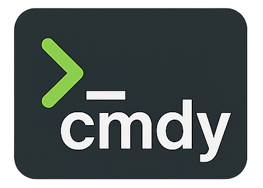

A modern CLI command assistant for running OS-specific commands through an interactive menu.

## Features

- **⚡ Lightning fast** - Optimized Go binary with minimal overhead
- **🌍 Cross-platform** - Linux, macOS, Windows support
- **📝 Simple config** - Clean YAML format, no complex syntax
- **🎨 Modern UI** - Beautiful fzf interface with fuzzy search
- **🔄 OS-aware** - Automatically runs the correct commands for your OS
- **🚀 Zero dependencies** - Single binary, no runtime requirements
- **🔍 Auto-discovery** - Automatically finds executable scripts
- **🛠️ Self-managing** - Updates and maintains itself
- **🔒 Config preservation** - Never overwrites your customizations
- **💬 Transparent** - Clear feedback and helpful error messages
- **🏗️ Layered structure** - Clear separation of examples vs user scripts
- **🔒 Safe customization** - User scripts protected from updates

## Installation

### 🚀 Quick Install (Recommended)

```bash
curl -sSL https://raw.githubusercontent.com/jdpierce21/cmdy/master/install.sh | bash
```

This one-liner will automatically:
- ✅ Install dependencies (fzf, Go)
- ✅ Build cmdy from source  
- ✅ Install to `~/.local/bin/cmdy`
- ✅ Set up configuration in `~/.config/cmdy/`
- ✅ Add to your PATH

### 🔧 Manual Installation

1. **Install dependencies**:
   ```bash
   # Ubuntu/Debian
   sudo apt install golang-go fzf
   
   # macOS
   brew install go fzf
   ```

2. **Clone and build**:
   ```bash
   git clone https://github.com/jdpierce21/cmdy.git
   cd cmdy
   go build -ldflags="-s -w" -o cmdy
   ```

3. **Install globally** (optional):
   ```bash
   sudo mv cmdy /usr/local/bin/
   ```

## Usage

### Interactive Menu
```bash
# Run the interactive menu
cmdy
```

### Self-Management Commands
```bash
cmdy build         # Build the binary
cmdy install       # Install/update globally  
cmdy dev [msg]     # Full development workflow (commit + push + install)
cmdy update        # Pull latest changes and rebuild
cmdy version       # Show current version (git commit)
cmdy config        # Edit configuration file
cmdy help          # Show all commands
```

### Navigation

- Use **arrow keys** or **type to search** (fuzzy matching)
- Press **Enter** to execute selected command
- Press **Ctrl+C** or **Escape** to exit
- Commands run in your current shell environment

## Configuration

### 🌍 Environment Variables

cmdy supports extensive customization through environment variables. All paths, URLs, and settings can be overridden:

**Core Paths:**
```bash
export CMDY_INSTALL_DIR="$HOME/.local/bin"     # Installation directory
export CMDY_CONFIG_DIR="$HOME/.config/cmdy"    # Configuration directory
export CMDY_SCRIPTS_EXAMPLES="scripts/examples" # Example scripts subdirectory
export CMDY_SCRIPTS_USER="scripts/user"        # User scripts subdirectory
```

**File Names:**
```bash
export CMDY_CONFIG_FILE="config.yaml"          # Main config file
export CMDY_CONFIG_BACKUP="config.yaml.new"    # Backup config file
export CMDY_BINARY_NAME="cmdy"                 # Binary name
```

**URLs and Resources:**
```bash
export CMDY_REPO_URL="https://github.com/jdpierce21/cmdy"
export CMDY_REPO_RAW_URL="https://raw.githubusercontent.com/jdpierce21/cmdy/master"
export CMDY_GO_INSTALL_URL="https://golang.org/doc/install"
export CMDY_FZF_INSTALL_URL="https://github.com/junegunn/fzf#installation"
export CMDY_INSTALL_SCRIPT="https://raw.githubusercontent.com/jdpierce21/cmdy/master/install.sh"
```

**UI Customization:**
```bash
export CMDY_COLOR_RED="\033[0;31m"             # Error messages
export CMDY_COLOR_GREEN="\033[0;32m"           # Success messages  
export CMDY_COLOR_BLUE="\033[0;34m"            # Info messages
export CMDY_COLOR_YELLOW="\033[1;33m"          # Warning messages
export CMDY_COLOR_RESET="\033[0m"              # Reset colors
```

**Messages:**
```bash
export CMDY_INSTALL_MESSAGE="🚀 Installing cmdy"
export CMDY_SUCCESS_INSTALL="✓ Installed"
export CMDY_SUCCESS_UPDATE="✓ Updated"
export CMDY_SUCCESS_COMPLETE="✓ Complete"
export CMDY_PREFIX_EXAMPLE="[example] "
export CMDY_PREFIX_USER="[user] "
export CMDY_DEFAULT_COMMIT="Update cmdy"
```

**Git Settings:**
```bash
export CMDY_GIT_BRANCH="master"                 # Default git branch
export CMDY_GIT_REMOTE="origin"                 # Default git remote
```

**Commands:**
```bash
export CMDY_FZF_COMMAND="fzf --header=Select an option: --height=~50% --layout=reverse"
export CMDY_FZF_HEADER="Select an option:"
export CMDY_GO_BUILD_FLAGS="-ldflags=-s -w"
export CMDY_SHELL_COMMAND="sh -c"
```

**Example: Custom Installation:**
```bash
# Install to custom location with custom branding
export CMDY_INSTALL_DIR="$HOME/bin"
export CMDY_CONFIG_DIR="$HOME/.my-cmdy"
export CMDY_INSTALL_MESSAGE="🔧 Installing My Custom CLI"
export CMDY_COLOR_BLUE="\033[0;35m"  # Purple instead of blue

# Run installer with custom settings
curl -sSL https://raw.githubusercontent.com/jdpierce21/cmdy/master/install.sh | bash
```

### 🏗️ Layered Script Structure

cmdy uses a **layered approach** for clear script ownership:

```
scripts/
├── examples/     # 📚 Stock scripts (auto-updated, don't edit)
├── user/         # 👤 Your scripts (preserved forever, safe to edit)
└── README.md     # 📖 Documentation
```

### 🚀 Quick Start

**For new scripts:**
```bash
# Add to user directory
cp my-script.sh scripts/user/
chmod +x scripts/user/my-script.sh
# Run cmdy - appears as "[user] my-script"!
```

**For customizing examples:**
```bash
# Copy from examples to user
cp scripts/examples/backup.sh scripts/user/my-backup.sh
chmod +x scripts/user/my-backup.sh
# Edit scripts/user/my-backup.sh safely
```

### Manual Configuration

Edit `config.yaml` for custom menu entries or to override auto-discovered scripts:

```yaml
menu_options:
  - display: "System Health - Check system resources"
    commands:
      linux: "htop"
      mac: "top"
      
  - display: "Network Info - Show network configuration"
    commands:
      linux: "ip addr show"
      mac: "ifconfig"
      
  # Reference user scripts (optional - auto-discovered if executable)
  - display: "My Custom Backup - Backup with notifications"
    commands:
      linux: "./scripts/user/my-backup.sh"
      mac: "./scripts/user/my-backup.sh"
      
  # Reference example scripts with custom names
  - display: "Quick System Cleanup - Remove temp files"
    commands:
      linux: "./scripts/examples/cleanup.sh"
      mac: "./scripts/examples/cleanup.sh"
```

### Configuration Format

- **`display`** - Text shown in the fzf menu (can be any descriptive text)
- **`commands`** - Map of OS-specific commands to run
  - Supported OS keys: `linux`, `mac`, `windows`
  - Use `darwin` instead of `mac` if needed (automatically mapped)

### 🧠 Smart Features

**Clear Ownership:**
- `[example] script-name` - From examples/ (updated automatically)
- `[user] script-name` - From user/ (yours forever)
- `script-name` - From config.yaml (manual entries)

**Smart Deduplication:**
- Scripts in `config.yaml` take precedence over auto-discovered
- No duplicate entries across examples/ and user/
- See discovery stats: `"Auto-discovered 5 scripts, deduplicated 2"`

**Safe Updates:**
- examples/ scripts refreshed on every update
- user/ scripts never touched during updates
- Your customizations preserved forever

### 🎯 Menu Navigation

- **Arrow keys** or **type to search** (fuzzy matching)
- **Enter** to execute selected command/script
- **Ctrl+C** or **Escape** to exit cleanly
- **No quit button needed** - built into fzf

### 🔄 Script Display Format

```bash
# Menu shows clear ownership:
[example] backup          # From examples/ directory
[example] cleanup         # From examples/ directory  
[user] my-backup         # From user/ directory
[user] my-task           # From user/ directory
System Health            # From config.yaml
Network Info             # From config.yaml
```

## 📚 Script Management

### 📚 Example Scripts (examples/ directory)

**Stock scripts provided by cmdy:**
- `backup.sh` - Database backup with timestamps
- `deploy.sh` - Application deployment to environments
- `cleanup.sh` - System cleanup and maintenance  
- `health-check.sh` - Comprehensive system health report

⚠️ **These are updated automatically - don't edit directly!**

### 👤 User Scripts (user/ directory)

**Your personal automation toolkit:**

```bash
# Create new script
echo '#!/bin/bash' > scripts/user/my-task.sh
echo 'echo "Hello from my script!"' >> scripts/user/my-task.sh
chmod +x scripts/user/my-task.sh

# Copy and customize example
cp scripts/examples/backup.sh scripts/user/my-backup.sh
vim scripts/user/my-backup.sh  # Safe to edit!

# Run cmdy to see your scripts
cmdy  # Shows "[user] my-task" and "[user] my-backup"
```

### 📄 Script Best Practices

**Structure:**
- Use `#!/bin/bash` or `#!/bin/sh` for shell scripts
- Add error handling with `set -e`
- Provide clear user feedback

**Organization:**
- **examples/**: Learning and templates (don't edit)
- **user/**: Your customizations and originals (safe to edit)
- **config.yaml**: Override display names if needed

**Development:**
- Make executable: `chmod +x scripts/user/your-script.sh`
- Test locally before adding to menu
- Version control your user/ directory for backup
- Use clear, descriptive file names

## Self-Management Workflow

### For Developers
```bash
# Make changes to cmdy
vim main.go

# One command does everything:
cmdy dev "add awesome feature"
# ✓ Stages all changes
# ✓ Commits with your message  
# ✓ Pushes to GitHub
# ✓ Builds and installs globally
# ✓ Ready to use immediately!
```

### For Users
```bash
# Get latest version
cmdy update

# Configure your preferences  
cmdy config

# Check current version
cmdy version
```

## Why cmdy?

- **⚡ Instant startup** - Highly optimized Go binary
- **📦 Single binary** - No dependency management or runtime requirements
- **🧠 Memory assistance** - Stop looking up commands constantly
- **🌐 OS-aware** - Same config works across all platforms
- **🎯 Modern UX** - Intuitive fzf interface with fuzzy search
- **⚙️ Config-driven** - Customize without touching code
- **🔧 Lean & Fast** - Minimal memory footprint, maximum performance
- **🤖 Self-managing** - Updates and maintains itself
- **💬 Transparent** - Always tells you what's happening

## Troubleshooting

### Common Issues

**"No menu options available"**
```bash
# Solutions:
1. Add entries to config.yaml
2. Add executable scripts to scripts/ directory  
3. Check example: https://github.com/jdpierce21/cmdy
```

**"cmdy: command not found"**
```bash
# Add to PATH:
export PATH="$HOME/.local/bin:$PATH"

# Or run directly:
~/.local/bin/cmdy
```

**"Could not find cmdy source directory"**
```bash
# Options for updating:
1. cd /path/to/cmdy && cmdy update
2. curl -sSL install.sh | bash  # Safest
3. git clone repo && cmdy install
```

**"No executable scripts found"**
```bash
# Add scripts to user directory:
cp my-script.sh ~/.config/cmdy/scripts/user/
chmod +x ~/.config/cmdy/scripts/user/my-script.sh

# Or copy from examples:
cp ~/.config/cmdy/scripts/examples/backup.sh ~/.config/cmdy/scripts/user/
```

**"No suitable editor found"**
```bash
# Set your preferred editor:
export EDITOR=vim

# Or install a basic editor:
sudo apt install nano  # Ubuntu/Debian
brew install nano       # macOS
```

**Config file issues**
- cmdy preserves your custom config during updates
- New defaults are saved as `config.yaml.new` for reference
- Check YAML syntax if parsing fails

**Script ownership confusion**
- `examples/` scripts are updated automatically (don't edit)
- `user/` scripts are yours forever (safe to edit)
- Copy from examples/ to user/ to customize
- Manual config.yaml entries override auto-discovered scripts

### 🔄 Migration from v1.x

**If upgrading from older versions:**
- Your scripts are automatically moved to `scripts/user/`
- Fresh examples installed to `scripts/examples/`
- Config preserved with new structure
- No manual migration needed!

### 🎆 Installation Paths

**Config locations:**
- Config: `~/.config/cmdy/config.yaml`
- Examples: `~/.config/cmdy/scripts/examples/`
- User scripts: `~/.config/cmdy/scripts/user/`
- Binary: `~/.local/bin/cmdy`

### Getting Help

- Run `cmdy help` for command overview
- Check verbose output - cmdy tells you what's happening
- All errors include specific solutions
- Script structure documented in `~/.config/cmdy/scripts/README.md`

## Development

### Quick Start
```bash
# Clone and build
git clone https://github.com/jdpierce21/cmdy.git
cd cmdy
cmdy build

# Development workflow
cmdy dev "your commit message"
```

### Manual Commands
```bash
# Run directly
go run .

# Build optimized binary
go build -ldflags="-s -w" -o cmdy

# Install from source
go install github.com/jdpierce21/cmdy@latest
```

### Helper Scripts

cmdy includes several helper scripts for development and deployment:

**`install.sh`** - Complete installation/update script
```bash
# Fresh installation:
curl -sSL https://raw.githubusercontent.com/jdpierce21/cmdy/master/install.sh | bash

# Local usage:
./install.sh [install|update] [git|download|auto]

# Examples:
./install.sh install          # Fresh install with auto-detection
./install.sh update git       # Update using existing git source
./install.sh update download  # Update by downloading fresh source
```

**`git-commit-push.sh`** - Git commit and push workflow
```bash
# Used internally by 'cmdy dev' command
./git-commit-push.sh "commit message" [remote] [branch]

# Features:
# - Checks for changes before proceeding
# - Shows what will be committed
# - Stages, commits, and pushes in one operation
# - Colorized output with progress indicators
# - Proper error handling
```